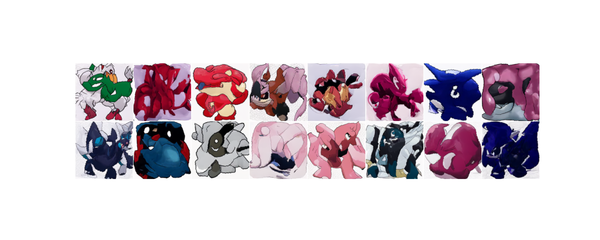

# DDPokeM
In this project I train an unconditional DDPM to sample images of Pokemon 
using the following dataset https://huggingface.co/datasets/huggan/pokemon. 
The method used is similar to that of Ho et al. (2020) [https://arxiv.
org/abs/2006.11239] with the changes to the scheduler and loss described in
Nichol et al. (2021) [https://arxiv.org/abs/2102.09672]. The network is 
a simple UNet with self attention applied at the 32x32 and 16x16 layers and is 
used to predict the added noise. 

To use the model run the following script:
```bash
python src/sample.py
```
This should produce images similar to the following:


The model seems to be doing an ok job at generating new Pokemon, but most of 
them seem to resemble a colourful forms of Muk. This is likely due to the 
relatively small dataset size.